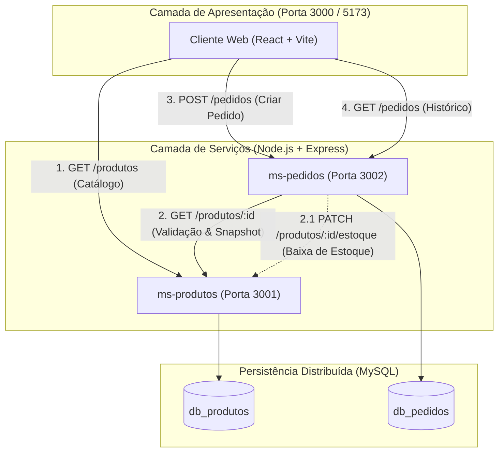

# Projeto: Arquitetura de Microserviços (DSW 3)

Projeto desenvolvido para a disciplina **Desenvolvimento Web 3 (DSW 3) - 5º Semestre** do **Curso Superior de Tecnologia em Análise e Desenvolvimento de Sistemas** do **Instituto Federal de Educação, Ciência e Tecnologia (IFSP)**.

- **Professor**: Prof. Me. André Luís Bordignon
- **Tecnologias**: Node.js, Express, Sequelize, MySQL 8.0, Axios, React, Vite, Docker Compose, Swagger (OpenAPI 3.0), Postman.

---

##  1. Arquitetura da Solução

O sistema adota o padrão arquitetural de **Microserviços** com desacoplamento de domínio e **Padrão Database-per-Service**:



###  Padrão Snapshot (Resiliência Financeira)
Ao processar um pedido no `ms-pedidos`, o serviço consulta o `ms-produtos` síncronamente via HTTP, verifica a existência do item e disponibilidade de estoque. Em seguida, grava um **snapshot** dos dados vigentes (`nomeProduto` e `precoUnitario`) no pedido. Mesmo que o lojista altere o preço ou o nome do produto no futuro, o histórico financeiro do pedido permanece intacto e imutável.

---

##  2. Entregáveis do MOMENTO 1 — 1ª Entrega Parcial (Aula 08)

Para a entrega exigida pelo professor no Moodle/Repositório, este projeto disponibiliza:

1. **Diagrama da Arquitetura Proposta**:
   - Arquivo completo em [`docs/arquitetura.md`](./docs/arquitetura.md) com diagramas Mermaid, detalhamento dos domínios e fluxo síncrono.
2. **Código Inicial Estruturado dos Dois Microserviços**:
   - [`/ms-produtos`](./ms-produtos): API Express com models, controllers, rotas e tratamento de erros.
   - [`/ms-pedidos`](./ms-pedidos): API Express com comunicação HTTP síncrona (Axios), snapshot pattern e controllers.
3. **Documentação das Rotas e Payloads de Exemplo**:
   - **Swagger Interativo**: Disponível diretamente em `/api-docs` em ambos os serviços (`http://localhost:3001/api-docs` e `http://localhost:3002/api-docs`).
   - **Coleção Postman/Insomnia**: Arquivo [`docs/postman/Microservicos_DSW3.postman_collection.json`](./docs/postman/Microservicos_DSW3.postman_collection.json) pronto para importar.
4. **Configuração e Schemas dos Bancos de Dados**:
   - Arquivo SQL unificado para MySQL Workbench: [`database/schema-workbench.sql`](./database/schema-workbench.sql).

---

##  3. Configuração dos Bancos de Dados no MySQL Workbench

Para criar e popular os bancos de dados independentes (`db_produtos` e `db_pedidos`) no MySQL Workbench:

1. Abra o **MySQL Workbench** e conecte-se à sua instância local do MySQL.
2. Abra o arquivo [`database/schema-workbench.sql`](./database/schema-workbench.sql) ou copie o conteúdo abaixo:

```sql
-- Criação do Banco de Produtos
CREATE DATABASE IF NOT EXISTS `db_produtos` DEFAULT CHARACTER SET utf8mb4 COLLATE utf8mb4_unicode_ci;
USE `db_produtos`;

CREATE TABLE IF NOT EXISTS `produtos` (
  `id` INT AUTO_INCREMENT PRIMARY KEY,
  `nome` VARCHAR(255) NOT NULL,
  `preco` DECIMAL(10, 2) NOT NULL,
  `descricao` TEXT NULL,
  `estoque` INT NOT NULL DEFAULT 0,
  `createdAt` DATETIME NOT NULL DEFAULT CURRENT_TIMESTAMP,
  `updatedAt` DATETIME NOT NULL DEFAULT CURRENT_TIMESTAMP ON UPDATE CURRENT_TIMESTAMP
) ENGINE=InnoDB;

-- Carga inicial de produtos
INSERT INTO `produtos` (`nome`, `preco`, `descricao`, `estoque`) VALUES
('Notebook Gamer Dell G15', 5299.90, 'Intel Core i7, 16GB RAM, SSD 512GB, RTX 3050', 10),
('Mouse Sem Fio Logitech MX Master 3S', 489.90, 'Design ergonômico, sensor 8K DPI e clique silencioso', 25),
('Teclado Mecânico Keychron K2', 650.00, 'Layout 75%, switches Gateron Brown, Bluetooth/Cabo', 15),
('Monitor Ultrawide LG 29"', 1299.00, 'Painel IPS Full HD 75Hz com HDR10 e FreeSync', 8),
('Headset HyperX Cloud II', 499.00, 'Som Surround 7.1 virtual e almofadas com memory foam', 0);

-- Criação do Banco de Pedidos
CREATE DATABASE IF NOT EXISTS `db_pedidos` DEFAULT CHARACTER SET utf8mb4 COLLATE utf8mb4_unicode_ci;
USE `db_pedidos`;

CREATE TABLE IF NOT EXISTS `pedidos` (
  `id` INT AUTO_INCREMENT PRIMARY KEY,
  `produtoId` INT NOT NULL,
  `nomeProduto` VARCHAR(255) NOT NULL,
  `precoUnitario` DECIMAL(10, 2) NOT NULL,
  `quantidade` INT NOT NULL,
  `valorTotal` DECIMAL(10, 2) NOT NULL,
  `dataPedido` DATETIME NOT NULL DEFAULT CURRENT_TIMESTAMP,
  `status` ENUM('REALIZADO', 'CANCELADO') NOT NULL DEFAULT 'REALIZADO',
  `createdAt` DATETIME NOT NULL DEFAULT CURRENT_TIMESTAMP,
  `updatedAt` DATETIME NOT NULL DEFAULT CURRENT_TIMESTAMP ON UPDATE CURRENT_TIMESTAMP
) ENGINE=InnoDB;

-- Pedidos de exemplo com Snapshot
INSERT INTO `pedidos` (`produtoId`, `nomeProduto`, `precoUnitario`, `quantidade`, `valorTotal`, `status`) VALUES
(1, 'Notebook Gamer Dell G15', 5299.90, 1, 5299.90, 'REALIZADO'),
(2, 'Mouse Sem Fio Logitech MX Master 3S', 489.90, 2, 979.80, 'REALIZADO');
```

3. Clique no ícone de raio (**Execute**) para rodar o script.
4. Os schemas `db_produtos` e `db_pedidos` estarão criados com as tabelas e dados iniciais prontos.

---

##  4. Como Executar o Projeto

Você tem duas formas práticas de rodar o projeto: **Via Docker Compose (Recomendado)** ou **Localmente com Node.js**.

### Opção A: Execução Completa via Docker Compose (Recomendado)
Sobe com um único comando: MySQL + ms-produtos + ms-pedidos + Frontend:

```bash
docker compose up --build
```

Acessos:
- **Frontend**: [http://localhost:3000](http://localhost:3000)
- **Swagger ms-produtos**: [http://localhost:3001/api-docs](http://localhost:3001/api-docs)
- **Swagger ms-pedidos**: [http://localhost:3002/api-docs](http://localhost:3002/api-docs)

---

### Opção B: Execução Local com Node.js

#### 1. Microserviço de Produtos (`ms-produtos`)
```bash
cd ms-produtos
npm install
npm start
# Executando na porta 3001
```

#### 2. Microserviço de Pedidos (`ms-pedidos`)
```bash
cd ms-pedidos
npm install
npm start
# Executando na porta 3002
```

#### 3. Frontend React (`frontend`)
```bash
cd frontend
npm install
npm run dev
# Executando na porta 3000
```

> **Dica**: Caso suas credenciais do MySQL local sejam diferentes de `root`/`root`, basta editar os arquivos `.env` dentro de cada pasta de microserviço (`ms-produtos/.env` e `ms-pedidos/.env`).

---

##  5. Referência dos Endpoints das APIs

### Microserviço 1: Produtos (`http://localhost:3001`)

| Método | Endpoint | Descrição | Exemplo de Payload |
| :--- | :--- | :--- | :--- |
| `GET` | `/health` | Health check do serviço | - |
| `GET` | `/produtos` | Listar todos os produtos | - |
| `GET` | `/produtos/:id` | Obter detalhes de um produto | - |
| `POST` | `/produtos` | Cadastrar novo produto | `{"nome":"Webcam 4K","preco":350.00,"descricao":"Full HD","estoque":10}` |
| `PUT` | `/produtos/:id` | Atualizar produto | `{"nome":"Webcam 4K Pro","preco":399.00,"estoque":12}` |
| `PATCH` | `/produtos/:id/estoque` | Ajustar estoque (delta) | `{"quantidadeDelta": -1}` |
| `DELETE` | `/produtos/:id` | Remover produto | - |

---

### Microserviço 2: Pedidos (`http://localhost:3002`)

| Método | Endpoint | Descrição | Exemplo de Payload |
| :--- | :--- | :--- | :--- |
| `GET` | `/health` | Health check do serviço | - |
| `GET` | `/pedidos` | Listar histórico de pedidos | - |
| `GET` | `/pedidos/:id` | Obter detalhes do pedido | - |
| `POST` | `/pedidos` | Criar pedido (Validação + Snapshot) | `{"produtoId": 1, "quantidade": 2}` |
| `PATCH` | `/pedidos/:id/cancelar` | Cancelar pedido e estornar estoque | - |

---

##  6. Simulação dos Cenários de Teste (Momento 2)

Utilize o Postman (importando a coleção em `docs/postman`) ou o Frontend para testar:

1. **Cenário de Sucesso**:
   - `POST /pedidos` com `{"produtoId": 1, "quantidade": 2}`
   - Resposta: `201 Created` com o snapshot do produto gravado e valor total calculado. O estoque do item é decrementado.
2. **Cenário de Produto Inexistente**:
   - `POST /pedidos` com `{"produtoId": 9999, "quantidade": 1}`
   - Resposta: `404 Not Found` -> `"Produto com ID 9999 não foi encontrado no catálogo."`
3. **Cenário de Falta de Estoque**:
   - `POST /pedidos` com `{"produtoId": 5, "quantidade": 1}` (produto ID 5 possui estoque 0)
   - Resposta: `400 Bad Request` -> `"Estoque insuficiente para o produto ..."`
4. **Cenário de Resiliência no Frontend (Momento 4)**:
   - Derrube o `ms-pedidos` (`Ctrl+C` no terminal do serviço).
   - O Frontend exibe alerta amigável de serviço offline e mantém o catálogo navegável sem quebrar a interface!
