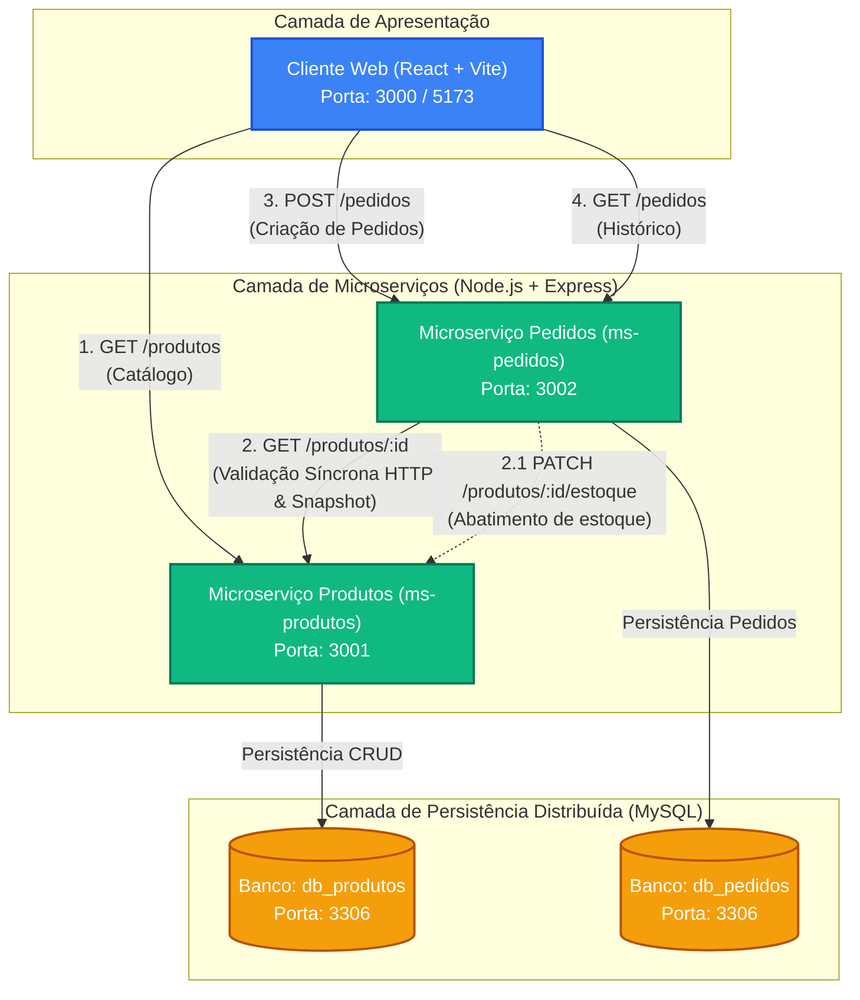

# Arquitetura do Sistema de Microserviços (DSW 3)

Projeto prático desenvolvido para a disciplina **Desenvolvimento Web 3 (DSW 3) - 5º Semestre** do **Curso Superior de Tecnologia em Análise e Desenvolvimento de Sistemas (IFSP)**.
Professor: **Prof. Me. André Luís Bordignon**.

---

## 1. Visão Geral da Arquitetura

O sistema é composto por **dois microserviços de backend autônomos** (`ms-produtos` e `ms-pedidos`) e uma aplicação **frontend única em React (Vite)**. Cada microserviço é independente, possui sua própria base de dados (Padrão *Database-per-Service*) e expõe sua própria API REST documentada via Swagger e Postman.



---

## 2. Componentes da Arquitetura

### 2.1. Microserviço 1: Produtos (`ms-produtos`)
- **Responsabilidade**: Gerenciamento do catálogo de produtos disponíveis e controle de inventário.
- **Porta padrão**: `3001`
- **Banco de Dados**: `db_produtos` (MySQL)
- **Tabela**: `produtos`
  - `id`: Identificador numérico único (Auto-Increment)
  - `nome`: Nome comercial do item (VARCHAR(255))
  - `preco`: Preço unitário atual (DECIMAL(10,2))
  - `descricao`: Detalhes e especificações (TEXT)
  - `estoque`: Quantidade de unidades disponíveis (INT)
- **Endpoints Principais**:
  - `POST /produtos`: Criação de novo produto no catálogo.
  - `GET /produtos`: Listagem geral de produtos.
  - `GET /produtos/:id`: Detalhes de um produto específico (usado tanto pelo Frontend quanto pelo `ms-pedidos`).
  - `PUT /produtos/:id`: Atualização cadastral.
  - `PATCH /produtos/:id/estoque`: Ajuste atômico de estoque.
  - `DELETE /produtos/:id`: Remoção de produto.

### 2.2. Microserviço 2: Pedidos (`ms-pedidos`)
- **Responsabilidade**: Gerenciamento do ciclo de vida das compras dos clientes, orquestrando a validação e aplicando o **Snapshot Pattern**.
- **Porta padrão**: `3002`
- **Banco de Dados**: `db_pedidos` (MySQL)
- **Tabela**: `pedidos`
  - `id`: Identificador numérico do pedido (Auto-Increment)
  - `produtoId`: Referência ao ID do produto originário
  - `nomeProduto`: **Snapshot** do nome do produto no instante da compra
  - `precoUnitario`: **Snapshot** do preço praticado no instante da compra
  - `quantidade`: Quantidade de itens adquiridos (INT)
  - `valorTotal`: Total consolidado da operação (DECIMAL(10,2))
  - `dataPedido`: Timestamp de emissão gerado automaticamente
  - `status`: Situação do pedido (`REALIZADO`, `CANCELADO`)
- **Endpoints Principais**:
  - `POST /pedidos`: Criação de novo pedido.
  - `GET /pedidos`: Histórico de todos os pedidos realizados.
  - `GET /pedidos/:id`: Detalhes de um pedido específico.
  - `PATCH /pedidos/:id/cancelar`: Cancelamento de pedido.

### 2.3. Frontend (`frontend`)
- **Tecnologia**: React 18 + Vite + Axios.
- **Porta padrão**: `3000` (ou `5173`)
- **Comportamento & Resiliência**:
  - Catálogo interativo com status em tempo real de estoque.
  - Formulário para submissão imediata de pedidos com validação de campos.
  - Modal para cadastro dinâmico de novos produtos.
  - Histórico de pedidos com cálculo e datas formatadas (padrão pt-BR).
  - Alertas amigáveis e tratamento de falhas: se algum microserviço estiver indisponível, a tela não quebra e o usuário é informado de forma transparente.

---

## 3. Padrão de Modelagem: Snapshot Pattern

Em uma arquitetura de microserviços de comércio eletrônico, o preço e a descrição de um produto sofrem alterações ao longo do tempo. 

Se o pedido armazenasse apenas a chave estrangeira `produtoId` e buscasse o valor dinamicamente, compras realizadas no passado teriam seus valores históricos alterados caso o lojista reajustasse o preço no catálogo.

Para garantir **imutabilidade e resiliência financeira**, o `ms-pedidos` implementa o **Snapshot Pattern**:
1. Ao receber a solicitação `POST /pedidos`, o `ms-pedidos` consulta síncronamente via HTTP o `ms-produtos`.
2. Se o produto não existir, retorna `404 Not Found`.
3. Se o estoque for inferior à quantidade solicitada, retorna `400 Bad Request`.
4. Uma vez validado, copia os valores atuais (`nomeProduto` e `precoUnitario`) para dentro da tabela de pedidos e calcula `valorTotal = precoUnitario * quantidade`.
5. Qualquer alteração futura no produto não afeta os pedidos previamente finalizados.

---

## 4. Comunicação Service-to-Service

A comunicação entre `ms-pedidos` e `ms-produtos` ocorre de forma síncrona via protocolo **HTTP/REST** utilizando **Axios**:

```
[Cliente React] ──── 1. POST /pedidos ────► [ms-pedidos]
                                                 │
                                                 │ 2. GET /produtos/:id (HTTP Síncrono)
                                                 ▼
                                           [ms-produtos]
                                                 │
                                                 │ 3. Retorna { id, nome, preco, estoque }
                                                 ▼
                                           [ms-pedidos]
                                           (Valida estoque e calcula snapshot)
                                                 │
                                                 │ 4. PATCH /produtos/:id/estoque
                                                 ▼
                                           [ms-produtos]
                                                 │
                                                 │ 5. Grava pedido em db_pedidos
                                                 ▼
[Cliente React] ◄─── 6. Retorna 201 Pedido ──────┴
```

---

## 5. Mapeamento de Portas e Serviços

| Serviço | Porta Local | Banco de Dados | Swagger Docs |
| :--- | :--- | :--- | :--- |
| **ms-produtos** | `3001` | MySQL (`db_produtos`) | `http://localhost:3001/api-docs` |
| **ms-pedidos** | `3002` | MySQL (`db_pedidos`) | `http://localhost:3002/api-docs` |
| **frontend** | `3000` (ou `5173`) | N/A | Interface Web Interativa |
| **mysql** | `3306` | Multi-Database (`db_produtos`, `db_pedidos`) | N/A |
